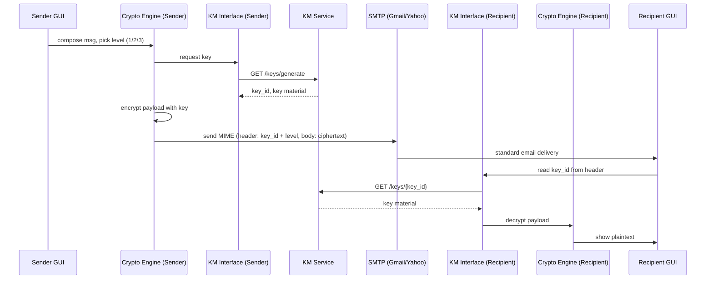

# Architecture

## 4-layer design

QuMail is split into 4 loosely-coupled layers. Each can be replaced independently — this is the answer to "why should I believe this is production-viable" from experienced faculty: **the mock KM is not load-bearing on the rest of the system.**

```
┌─────────────────────────────────────────────┐
│  1. GUI / Client Layer (PyQt5 or CLI)        │  compose, choose security level, view inbox
├─────────────────────────────────────────────┤
│  2. Email Protocol Layer (imaplib/smtplib)   │  talks to Gmail/Yahoo over IMAP/SMTP + OAuth2
├─────────────────────────────────────────────┤
│  3. Crypto Engine (strategy pattern)         │  Level 1/2/3 encrypt-decrypt implementations
├─────────────────────────────────────────────┤
│  4. KM Interface Layer (REST client)         │  talks to the Key Manager over HTTP
└─────────────────────────────────────────────┘
                       │
                       ▼
        ┌───────────────────────────┐
        │  Key Manager (KM) service │  ETSI GS QKD 014-shaped REST API
        │  — mock today, real QKD   │
        │    hardware later         │
        └───────────────────────────┘
```

**Why this order matters:** the GUI never touches crypto directly, and the crypto engine never touches IMAP directly. Swapping PyQt5 for a web UI, or swapping AES for a post-quantum KEM, or swapping the mock KM for real QKD hardware, is a change to exactly one layer.

## End-to-end data flow (sending a message)



**The one line that matters most in this diagram:** the key material only ever travels between a client and *its own* KM instance — never through SMTP, never through the email body. Only `key_id` and `security_level` ride in the email header. This is the entire security premise of the system; if faculty ask one thing, it's this.

## Component responsibilities

| Component | Responsibility | Does NOT do |
|---|---|---|
| GUI | Compose, select level, render inbox | Any crypto, any key handling |
| Email Protocol Layer | IMAP fetch, SMTP send, MIME packaging | Encrypt/decrypt, key requests |
| Crypto Engine | Encrypt/decrypt per selected level, enforce key-reuse rules | Talk to IMAP/SMTP, talk to network for keys directly |
| KM Interface | HTTP client to KM, caches nothing sensitive beyond one call | Persist keys long-term client-side |
| KM Service | Issue/store/retire keys, enforce single-use for OTP | Know anything about email content |

## Why 4 layers and not fewer

A faculty member with 15+ years in security will immediately ask "why not just bolt AES onto SMTP directly?" The answer: coupling crypto to the transport layer is exactly the anti-pattern that made PGP/S-MIME painful to adopt and made retrofits impossible. Separating the KM interface means the *only* thing that changes when real QKD hardware arrives is layer 4's implementation — GUI, protocol layer, and crypto engine are untouched.
